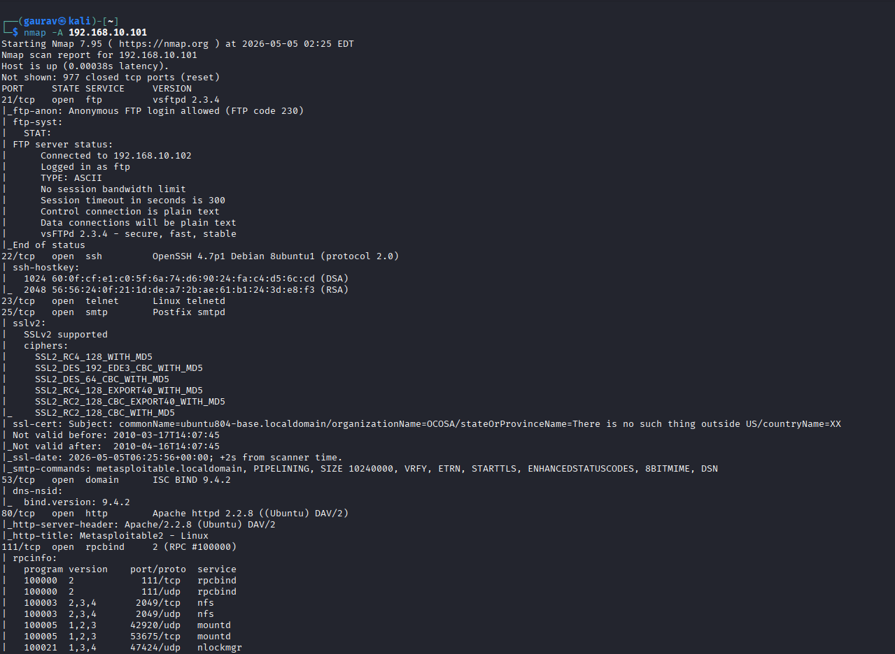
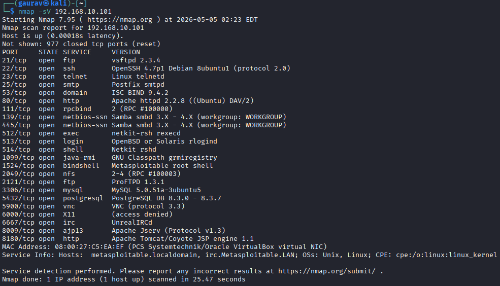
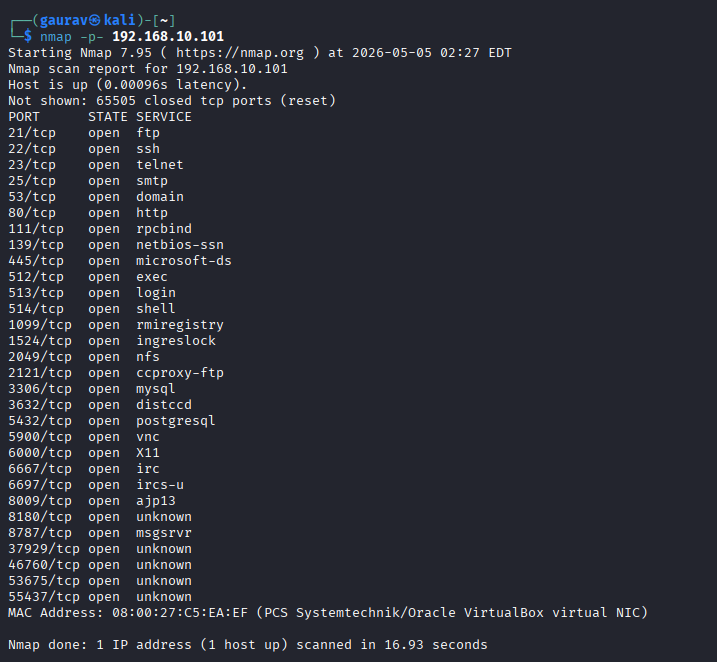

# Network Scanning & Vulnerability Assessment using Nmap

## 📌 Description
Performed network scanning and vulnerability assessment on Metasploitable using Nmap in a controlled lab environment.

## 🛠️ Tools Used
- Nmap
- Kali Linux
- Metasploitable

## 🔍 Scans Performed

### 🔹 Aggressive Scan (-A)
Provides detailed information including OS detection, services, and scripts.

---

### 🔹 Service Version Scan (-sV)
Identifies versions of running services.

---

### 🔹 Full Port Scan (-p-)
Scans all ports to detect open ports.

---

## 📊 Key Findings
- Multiple open ports detected (21, 22, 23, 80, 3306)
- Telnet (port 23) is insecure
- Some services are outdated and potentially vulnerable

## 🧠 Conclusion
This project demonstrates practical knowledge of network scanning, service enumeration, and basic vulnerability assessment.
